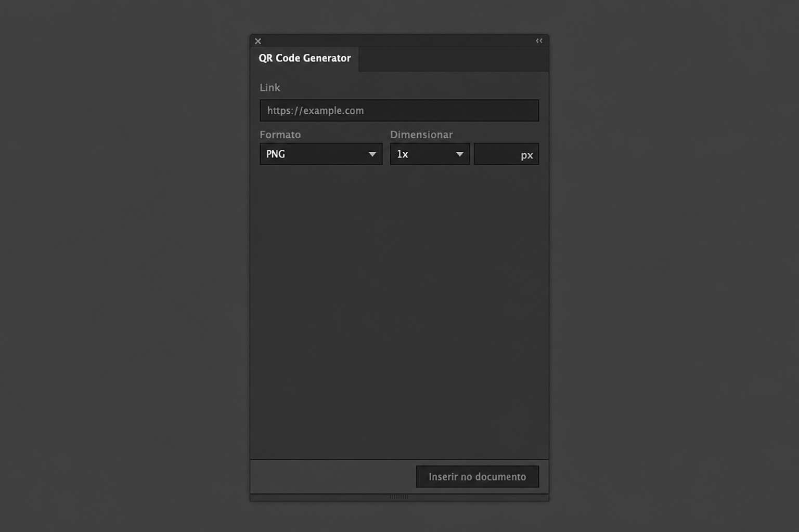

# QR Code Generator for Adobe Illustrator

Create QR codes directly inside Adobe Illustrator. Paste a link, choose SVG or PNG, and insert the QR code into your active document without leaving Illustrator.

## Download and install

1. Download the latest `.zxp` file from [GitHub Releases](https://github.com/diegodamacenoo/illustrator-qr-code-generator/releases/latest).
2. Install [aescripts ZXP Installer](https://aescripts.com/learn/zxp-installer/).
3. Open the downloaded `.zxp` file with aescripts ZXP Installer.
4. Restart Adobe Illustrator.
5. In Illustrator, open `Window > Extensions > QR Code Generator`.

## How to use

1. Open or create a document in Adobe Illustrator.
2. Open `Window > Extensions > QR Code Generator`.
3. Paste your link into the `Link` field.
4. Choose `SVG` for editable vector artwork or `PNG` for a raster image.
5. If you choose `PNG`, set the scale or size in `Dimensionar`.
6. Click `Inserir no documento`.

## What it creates

- `SVG`: an editable vector group centered on the active artboard.
- `PNG`: an embedded raster image using the selected size.
- Links are normalized automatically, so `example.com` becomes `https://example.com`.
- QR codes are generated locally in the plugin. Your link is not sent to any server.

## Troubleshooting

If the panel does not appear, restart Illustrator and check `Window > Extensions > QR Code Generator` again.

If you still see an old tab called `QR Code SVG`, close it, uninstall the old extension, then reinstall the latest `.zxp` with aescripts ZXP Installer.

If the panel opens blank, remove any previous version of the plugin from your ZXP installer, reinstall the latest release, and restart Illustrator.

## For developers

End users do not need these steps.

This is a CEP extension for Adobe Illustrator. The packaged `.zxp` is published in [GitHub Releases](https://github.com/diegodamacenoo/illustrator-qr-code-generator/releases/latest); local build artifacts and certificates stay out of Git.

To package locally, install Adobe `ZXPSignCmd`, provide a `.p12` certificate, then run:

```bash
CERT_PATH=/path/to/certificate.p12 CERT_PASSWORD='password' ./scripts/package-zxp.sh
```

For local CEP-folder testing on macOS:

```bash
./scripts/enable-unsigned-cep-macos.sh
./scripts/install-local-macos.sh
```
